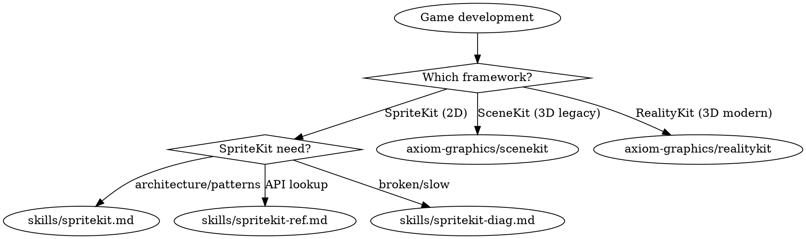

# Games

**You MUST use this skill for ANY game development, SpriteKit, SceneKit, RealityKit, or interactive simulation work.**

## Quick Reference

| Symptom / Task | Reference |
|----------------|-----------|
| Building a SpriteKit game | See `skills/spritekit.md` |
| SpriteKit API lookup | See `skills/spritekit-ref.md` |
| Physics contacts not firing | See `skills/spritekit-diag.md` |
| Frame rate drops (SpriteKit) | See `skills/spritekit-diag.md` |
| Touches not registering | See `skills/spritekit-diag.md` |
| Memory spikes in gameplay | See `skills/spritekit-diag.md` |
| Coordinate confusion | See `skills/spritekit-diag.md` |
| Scene transition crashes | See `skills/spritekit-diag.md` |
| Objects tunneling through walls | See `skills/spritekit-diag.md` |
| SpriteKit node/action reference | See `skills/spritekit-ref.md` |
| SceneKit maintenance/migration | See axiom-graphics (skills/scenekit.md) |
| SceneKit API / migration mapping | See axiom-graphics (skills/scenekit-ref.md) |
| RealityKit (3D, ECS, AR) | See axiom-graphics (skills/realitykit.md) |
| RealityKit API reference | See axiom-graphics (skills/realitykit-ref.md) |
| RealityKit diagnostics | See axiom-graphics (skills/realitykit-diag.md) |

## External Routes

These topics are part of the broader games/3D domain but live in separate skill suites:

**SceneKit (3D — soft-deprecated iOS 26):**
- Maintenance and migration planning → See axiom-graphics (skills/scenekit.md)
- API reference and migration mapping → See axiom-graphics (skills/scenekit-ref.md)

**RealityKit (3D — modern):**
- ECS architecture, AR, SwiftUI integration → See axiom-graphics (skills/realitykit.md)
- API reference → See axiom-graphics (skills/realitykit-ref.md)
- Troubleshooting → See axiom-graphics (skills/realitykit-diag.md)

## Decision Tree

1. Building/designing a 2D SpriteKit game? → `skills/spritekit.md`
2. How to use a specific SpriteKit API? → `skills/spritekit-ref.md`
3. SpriteKit broken or performing badly? → `skills/spritekit-diag.md`
4. Maintaining existing SceneKit code? → See axiom-graphics (skills/scenekit.md)
5. SceneKit API reference or migration mapping? → See axiom-graphics (skills/scenekit-ref.md)
6. Building new 3D game or experience? → See axiom-graphics (skills/realitykit.md)
7. How to use a specific RealityKit API? → See axiom-graphics (skills/realitykit-ref.md)
8. RealityKit entity not visible, gestures broken, performance? → See axiom-graphics (skills/realitykit-diag.md)
9. Migrating SceneKit to RealityKit? → See axiom-graphics (skills/scenekit.md) (migration tree) + See axiom-graphics (skills/scenekit-ref.md) (mapping table)
10. Building AR game? → See axiom-graphics (skills/realitykit.md)
11. Want automated SpriteKit code scan? → `spritekit-auditor` agent

## Automated Scanning

**SpriteKit audit** → Launch `spritekit-auditor` agent or `/axiom:audit spritekit`

Detects anti-patterns AND architectural gaps:
- Physics bitmask issues (default `0xFFFFFFFF`, missing `contactTestBitMask`, magic numbers)
- Draw call waste (`SKShapeNode` in gameplay, missing texture atlases)
- Node accumulation and runaway spawn-in-`update()` without cleanup
- Action memory leaks (strong `self`, `.repeatForever` without `withKey:`)
- Coordinate confusion (`touch.location(in: self.view)` instead of `in: self`)
- Silent input dead zones (custom `touchesBegan` without `isUserInteractionEnabled`)
- Missing object pooling for hot spawns
- Missing/ungated debug overlays
- Leaked scenes (transition without `removeAllActions()` and child cleanup)
- Missing time-step clamping → spiral-of-death teleports bodies through walls
- HUD attached to scene root instead of camera (drifts with scrolling)
- Fast bodies without `usesPreciseCollisionDetection` (tunneling)

Scores: PERFORMANT / DEGRADED / UNPLAYABLE

## Critical Patterns

**SpriteKit** (`skills/spritekit.md`):
- PhysicsCategory struct with explicit bitmasks (default `0xFFFFFFFF` causes phantom collisions)
- Camera node pattern for viewport + HUD separation
- SKShapeNode pre-render-to-texture conversion
- `[weak self]` in all `SKAction.run` closures
- Delta time with spiral-of-death clamping

**SpriteKit diagnostics** (`skills/spritekit-diag.md`):
- 5-step bitmask checklist (2 min vs 30-120 min guessing)
- Debug overlays as mandatory first diagnostic step
- Tunneling prevention flowchart
- Memory growth diagnosis via `showsNodeCount` trending

## Anti-Rationalization

| Thought | Reality |
|---------|---------|
| "SpriteKit is simple, I don't need a skill" | Physics bitmasks default to 0xFFFFFFFF and cause phantom collisions. The bitmask checklist catches this in 2 min. |
| "I'll just use SKShapeNode, it's quick" | Each SKShapeNode is a separate draw call. 50 of them = 50 draw calls. spritekit.md has the pre-render-to-texture pattern. |
| "I can figure out the coordinate system" | SpriteKit uses bottom-left origin (opposite of UIKit). Anchor points add another layer. spritekit-diag.md Symptom 6 resolves in 5 min. |
| "Physics is straightforward" | Three different bitmask properties, modification rules inside callbacks, and tunneling edge cases. spritekit.md Section 3 covers all gotchas. |
| "The performance is fine on my device" | Performance varies dramatically across devices. spritekit.md Section 6 has the debug overlay checklist. |
| "SceneKit is fine for our new project" | SceneKit is soft-deprecated iOS 26. No new features, only security patches. axiom-graphics (skills/scenekit.md) has the migration decision tree. |
| "ECS is overkill for a simple 3D app" | You're already using ECS — Entity + ModelComponent. axiom-graphics (skills/realitykit.md) shows how to scale from simple to complex. |
| "I don't need collision shapes for taps" | RealityKit gestures require CollisionComponent. axiom-graphics (skills/realitykit-diag.md) diagnoses this in 2 min vs 30 min guessing. |

## Example Invocations

User: "I'm building a SpriteKit game"
→ See `skills/spritekit.md`

User: "My physics contacts aren't firing"
→ See `skills/spritekit-diag.md`

User: "How do I create a physics body from a texture?"
→ See `skills/spritekit-ref.md`

User: "Frame rate is dropping in my game"
→ See `skills/spritekit-diag.md`

User: "What action types are available?"
→ See `skills/spritekit-ref.md`

User: "Objects pass through walls"
→ See `skills/spritekit-diag.md`

User: "I need to build a 3D game"
→ Invoke: See axiom-graphics (skills/realitykit.md)

User: "I'm migrating from SceneKit to RealityKit"
→ Invoke: See axiom-graphics (skills/scenekit.md) + See axiom-graphics (skills/scenekit-ref.md)

User: "Can you scan my SpriteKit code for common issues?"
→ Launch `spritekit-auditor` agent
