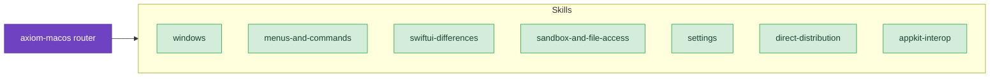

# macOS

Build native macOS apps the supported way — SwiftUI-first, multi-window, keyboard-driven, sandboxed, and ready for Mac App Store or Developer ID distribution. These skills cover scene types, menu bar commands, AppKit interop, App Sandbox file access, Settings panes, and notarized direct distribution.

## When to Use These Skills

Use macOS skills when you're:

- Building a new macOS app or adding a Mac target to an iOS-first codebase
- Picking between `WindowGroup`, `Window`, `UtilityWindow`, `MenuBarExtra`, and `Settings`
- Wiring menu bar commands to the focused window via `focusedSceneValue`
- Bringing SwiftUI patterns from iOS to macOS — Table, NavigationSplitView, Inspector, focus, toolbars
- Adopting App Sandbox, security-scoped bookmarks, and file-access entitlements
- Adding a Settings (Preferences) window with tabbed panes and `@AppStorage`
- Distributing outside the Mac App Store via Developer ID, `notarytool`, and Sparkle
- Embedding AppKit views in SwiftUI (or vice versa) with `NSViewRepresentable` and `NSHostingController`

## Example Prompts

Questions you can ask Claude that will draw from these skills:

- "How do I structure a macOS app that has a main window plus an activity panel?"
- "My menu bar commands are always disabled — what's wrong?"
- "Should this be a `List` or a `Table`?"
- "My app works in debug but fails to open files in release. Why?"
- "How do I notarize and staple my app for Developer ID distribution?"
- "Where should the Settings window's `.frame()` go — on the `TabView` or each tab?"
- "I need to embed an NSTextView inside SwiftUI. What's the lifecycle?"

## Skills

- **[Windows](/skills/macos/windows)** — Scene types, `openWindow`, default size, MenuBarExtra, UtilityWindow
  - *"WindowGroup vs Window vs UtilityWindow — which do I use?"*
  - *"How do I open a detail window from a context menu without adding a File menu item?"*

- **[Menus and Commands](/skills/macos/menus-and-commands)** — Menu bar architecture, `CommandMenu`/`CommandGroup`, `focusedSceneValue`, context menus
  - *"Why is my menu item always disabled even though the window is focused?"*
  - *"How do I add 'New Plant' before the standard 'New' group in the File menu?"*

- **[SwiftUI Differences](/skills/macos/swiftui-differences)** — Table vs List, NavigationSplitView, Inspector, focus, toolbars, multi-window state
  - *"My iPad-style sheet feels wrong on Mac. What's the macOS equivalent?"*
  - *"My table headers show sort indicators but the rows don't reorder. What did I miss?"*

- **[Sandbox and File Access](/skills/macos/sandbox-and-file-access)** — App Sandbox model, fileImporter, security-scoped bookmarks, entitlements
  - *"My app loses file access after a few open/close cycles. What's leaking?"*
  - *"How do I keep access to a user-selected folder across app launches?"*

- **[Settings](/skills/macos/settings)** — `Settings` scene, tabbed panes, sizing, `SettingsLink`, `@AppStorage`
  - *"Where does the `.frame()` go on a tabbed Settings window?"*
  - *"How do I share one codebase across iOS and macOS where macOS needs a Settings scene?"*

- **[Direct Distribution](/skills/macos/direct-distribution)** — Developer ID code signing, `notarytool`, stapling, packaging, Sparkle auto-updates
  - *"My notarization keeps failing with 'signature does not include a secure timestamp.' How do I fix it?"*
  - *"What's the right order to sign an app with embedded frameworks and XPC services?"*

- **[AppKit Interop](/skills/macos/appkit-interop)** — `NSViewRepresentable`, `NSHostingController`/`NSHostingView`, responder chain, NSToolbar bridging
  - *"How do I host an `NSTextView` inside SwiftUI and keep bindings synced?"*
  - *"My SwiftUI cells inside `NSCollectionView` cause scroll jank. What's the right reuse pattern?"*

## Related

- **[axiom-swiftui](/skills/ui-design/)** — Cross-platform SwiftUI patterns (state, layout, animations, navigation fundamentals) that the macOS-specific patterns build on
- **[axiom-security](/skills/security/)** — Keychain, encryption, passkeys, and certificate management; pair with sandbox-and-file-access and direct-distribution
- **[axiom-shipping](/skills/shipping/)** — App Store submission, rejections, privacy manifests; complements direct-distribution for App Store-bound macOS apps
- **[axiom-uikit](/skills/ui-design/)** — UIKit-SwiftUI bridging; same `Representable` pattern as AppKit interop but with `UIView`/`UIViewController`
- **[axiom-payments](/skills/integration/)** — Apple Pay on Mac and Catalyst payment patterns
