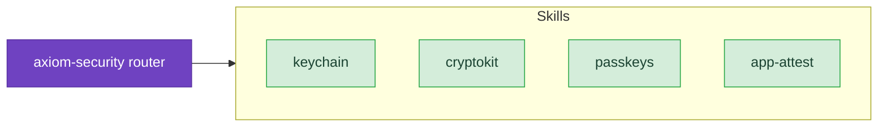

# Security

Store credentials safely, encrypt with modern algorithms, sign in users without passwords, and prove your binary hasn't been tampered with. These skills cover the four Apple security frameworks every app touches eventually — Keychain Services, CryptoKit, Authentication Services (passkeys), and App Attest — plus the day-to-day discipline around picking the right `kSecAttrAccessible` level, the right algorithm family, and the right server-side validation.

## When to Use These Skills

Use security skills when you're:

- Storing passwords, tokens, refresh tokens, or any credential that must survive app updates and device migrations
- Encrypting data at rest, signing payloads, or generating keys in the Secure Enclave
- Adding passkey sign-in (or migrating an existing password-based account to passkeys)
- Verifying that requests to your server come from an unmodified copy of your app
- Debugging `errSecDuplicateItem`, `errSecItemNotFound`, or `ASAuthorization*` errors
- Choosing the right `kSecAttrAccessible` level for a credential, or the right algorithm family for a use case
- Adopting post-quantum cryptography (ML-KEM, ML-DSA) before Apple's deprecation timelines

## Example Prompts

Questions you can ask Claude that will draw from these skills:

- "How do I store an OAuth refresh token so it survives device restore from iCloud backup?"
- "I'm getting `errSecDuplicateItem` on every update — what's the right SecItem pattern?"
- "Should I use AES-GCM or ChaChaPoly for encrypting local files?"
- "How do I generate an ECDSA key in the Secure Enclave and use it to sign API requests?"
- "What's the migration path from password sign-in to passkeys without forcing users to re-enroll?"
- "My passkey registration succeeds on iOS but fails on macOS Safari — what changed?"
- "How do I roll out App Attest without breaking users on devices that don't support it?"
- "I need biometric protection on my keychain item — does Face ID happen before or after `SecItemCopyMatching`?"

## Skills

- **[Keychain](/skills/security/keychain)** — Secure credential storage with SecItem APIs, accessibility levels, access groups, biometric protection
  - *"How do I store a token so the app extension can read it but other apps can't?"*
  - *"Why does my keychain item disappear after the user restores from backup?"*

- **[CryptoKit](/skills/security/cryptokit)** — Symmetric and asymmetric crypto, hashing, Secure Enclave keys, HPKE, post-quantum algorithms
  - *"AES-GCM or ChaChaPoly — which one for at-rest file encryption?"*
  - *"How do I migrate my CommonCrypto AES code to CryptoKit?"*

- **[Passkeys](/skills/security/passkeys)** — WebAuthn ceremony, AutoFill integration, password-to-passkey upgrades, cross-platform flows
  - *"What's the right `ASAuthorizationPlatformPublicKeyCredentialProvider` flow for sign-up?"*
  - *"How do I support passkeys *and* keep a password fallback for users on older devices?"*

- **[App Attest](/skills/security/app-attest)** — DeviceCheck framework, server-side attestation validation, assertion lifecycle
  - *"How do I validate the attestation object on my server?"*
  - *"My App Attest rollout is breaking 5% of users on simulator builds — what's the right gate?"*

## Related

- **[axiom-shipping](/skills/shipping/)** — App Store submission and privacy manifests; security frameworks have Required Reason API declarations that App Review enforces
- **[axiom-integration](/skills/integration/privacy-ux)** — Privacy UX, permission prompts, and Privacy Manifests; pair with this suite when sensitive data is involved
- **[axiom-macos](/skills/macos/sandbox-and-file-access)** — App Sandbox model and security-scoped bookmarks; pair with keychain access groups for sandboxed macOS apps
- **[axiom-networking](/skills/integration/networking)** — URLSession authentication challenges and TLS pinning; CryptoKit is the right primitive for client-side signing of requests
- **[axiom-data](/skills/persistence/)** — SwiftData, Core Data, GRDB; security applies when persisting credentials or encrypted blobs
